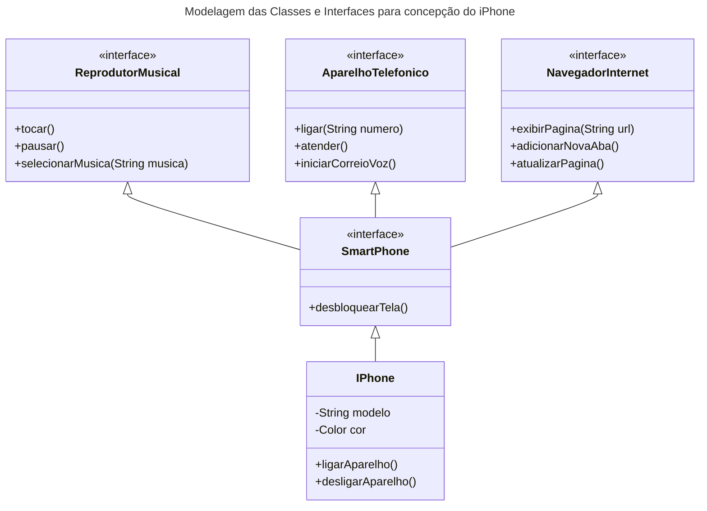

# [DIO](www.dio.me) - Trilha Java Básico

## Aluno
- [Rafael Prenholato](https://github.com/rprenhol)

## POO - Desafio

### Diagrama de Classes UML (Mermaid)

```mermaid
---
title: Modelagem das Classes e Interfaces para concepção do iPhone
---

classDiagram
    class ReprodutorMusical {
        <<interface>>
        +tocar()
        +pausar()
        +selecionarMusica(String musica)
    }

    class AparelhoTelefonico {
        <<interface>>
        +ligar(String numero)
        +atender()
        +iniciarCorreioVoz()
    }

    class NavegadorInternet {
        <<interface>>
        +exibirPagina(String url)
        +adicionarNovaAba()
        +atualizarPagina()
    }

    class SmartPhone {
        <<interface>>
        +desbloquearTela()
    }

    class IPhone {
        -String modelo
        -Color cor

        +ligarAparelho()
        +desligarAparelho()
    }

    ReprodutorMusical <|-- SmartPhone
    AparelhoTelefonico <|-- SmartPhone
    NavegadorInternet <|-- SmartPhone

    SmartPhone <|-- IPhone
```
```` 
